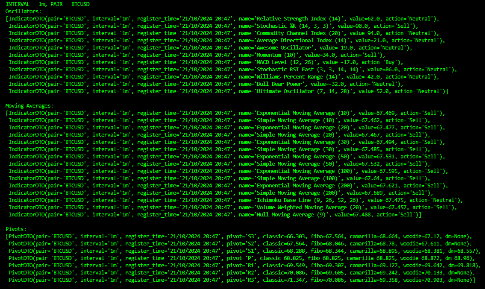

# TradingView Scraper


This scraper is designed to fetch financial data, specifically technical indicators and pivot points, from TradingView in a performant way. The scraper efficiently extracts this data for multiple asset pairs across various time intervals, using Selenium for web automation and Pydantic for data validation.

PT-BR:
Scraper foi projetado para buscar dados financeiros, especificamente indicadores técnicos e pontos pivôs, do TradingView de forma eficiente. O scraper extrai esses dados de maneira eficiente para múltiplos pares de ativos em vários intervalos de tempo, utilizando Selenium para automação web e Pydantic para validação de dados.

## Features

- **Performance-Oriented**: The scraper uses `WebDriverWait` to minimize unnecessary waits, ensuring efficient scraping.
- **Technical Indicators**: Fetches oscillators and moving averages for specified asset pairs.
- **Pivot Points**: Retrieves pivot points in different formats (Classic, Fibonacci, Camarilla, Woodie, DM).
- **Customizable Intervals**: Scrapes data for a variety of time intervals (1m, 5m, 15m, 30m, 1h, 2h, 4h, 1D, 1W, 1M).
- **Structured Data**: The extracted data is validated using Pydantic models, making it easier to integrate into other systems or databases.

## Project Structure

```
.
├── README.md
├── pairs.json           # List of asset pairs to scrape
├── pyproject.toml       # Python project configuration
├── requirements.txt     # Python dependencies
├── src/
│   ├── chrome_config.py # ChromeDriver setup and configuration
│   ├── main.py          # Main script to run the scraper
│   └── models.py        # Pydantic models for structured data
└── uv.lock              # Lockfile for dependencies
```

## Installation

Follow the steps below to set up the project and run the scraper.

### 1. Clone the Repository

```bash
git clone https://github.com/pedrohcleal/TradingViewScraper.git
cd TradingViewScraper
```

### 2. Create a Virtual Environment

Make sure you have Python installed. Create a virtual environment to isolate the project dependencies:

```bash
python -m venv venv
```

### 3. Activate the Virtual Environment

- On Windows:
  ```bash
  venv\Scripts\activate
  ```

- On macOS/Linux:
  ```bash
  source venv/bin/activate
  ```

### 4. Install Dependencies

With the virtual environment activated, install the required dependencies from `requirements.txt`:

```bash
pip install -r requirements.txt
```

### 5. Configure WebDriver

Ensure you have ChromeDriver installed and available in your system's PATH. Alternatively, modify `chrome_config.py` to point to your ChromeDriver executable.

### 6. Run the Scraper

The scraper uses a JSON file (`pairs.json`) that contains a list of asset pairs to scrape. Once everything is set up, run the scraper:

```bash
python src/main.py
```

The script will scrape the financial data for the pairs and intervals specified in the code, outputting the results to the console.

## Notes

- The scraper is optimized for performance with WebDriver waits to ensure it only interacts with the page when elements are ready.
- Make sure your internet connection is stable, as the scraper fetches data from TradingView.
- You can customize the time intervals and pairs by editing the `intervals` list and the `pairs.json` file.


## Log snapshot


